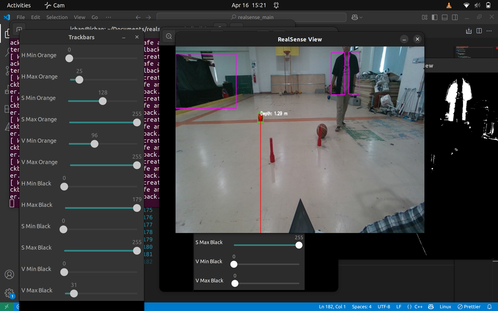

### Requirements

- opencv contrib: https://github.com/opencv/opencv_contrib

- librealsense: https://github.com/IntelRealSense/librealsense/blob/master/doc/installation.md

### Build & Run

       git clone https://github.com/ichsanyudika12/realsense2-seg.git
       cd realsense2_seg
       mkdir build
       cd build
       cmake ..
       make
       ./main

### Results

